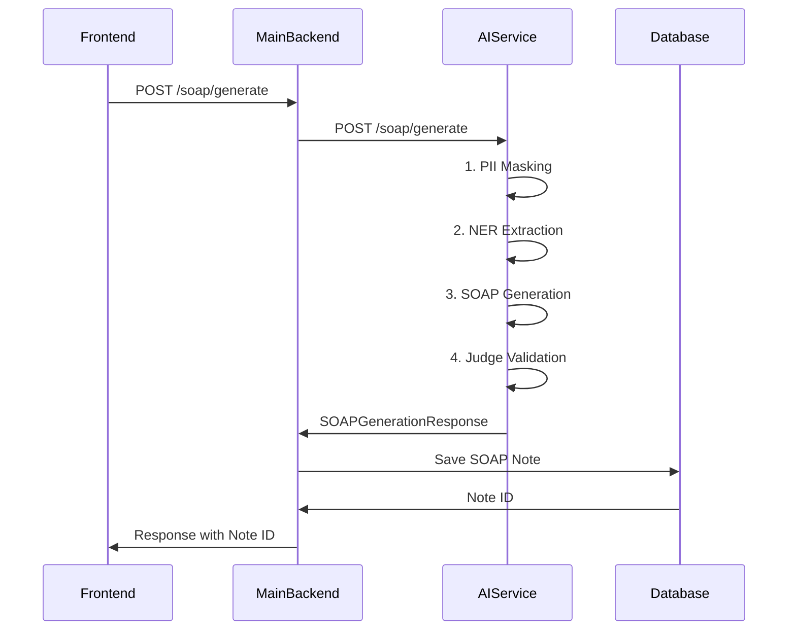

# Echo Notes Backend Architecture PRD

## Product Requirements Document: Microservice Architecture

**Version:** 1.0  
**Date:** 2024  
**Status:** Implemented

---

## Table of Contents

1. [Overview](#overview)
2. [Architecture Patterns](#architecture-patterns)
3. [System Architecture](#system-architecture)
4. [Microservice Design](#microservice-design)
5. [Service Communications](#service-communications)
6. [Data Flow](#data-flow)
7. [Folder Structure](#folder-structure)
8. [API Specifications](#api-specifications)
9. [Database Schema](#database-schema)
10. [Deployment Architecture](#deployment-architecture)

---

## Overview

Echo Notes is an AI-powered SOAP note generation system designed for hearing care professionals. The system uses a microservice architecture to separate concerns and enable independent scaling of AI operations.

### Key Features

- **AI-Powered SOAP Generation**: Automated medical note creation
- **PII Protection**: Privacy-preserving text processing
- **RAG-based Queries**: Intelligent patient data retrieval
- **Document Management**: Secure file storage and processing
- **Real-time Health Monitoring**: Comprehensive service monitoring

### Architecture Goals

- **Scalability**: Independent scaling of AI and business logic
- **Maintainability**: Clear separation of concerns
- **Performance**: Optimized AI model loading and caching
- **Security**: PII protection and secure communications
- **Reliability**: Fault tolerance and error handling

---

## Architecture Patterns

### 1. Microservice Pattern

```
Main Backend (Business Logic) ←→ AI Service (ML/AI Operations)
       ↓                              ↓
   PostgreSQL Database (Shared)    Model Cache
```

### 2. Service Communication

- **Synchronous**: HTTP/REST APIs for request-response operations
- **Asynchronous**: Future: Message queues for background processing
- **Database Sharing**: Shared PostgreSQL with pgvector for consistency

### 3. Data Patterns

- **Command Query Responsibility Segregation (CQRS)**: Separate read/write operations
- **Event Sourcing**: Audit logging for compliance
- **Vector Storage**: pgvector for embeddings and similarity search

---

## System Architecture

### High-Level Architecture Diagram

The system follows a microservice architecture with clear separation between business logic and AI operations:

[See the architecture diagram above]

### Architecture Components

#### 1. **Client Layer**

- **Web Frontend**: Next.js application serving the user interface
- **Mobile App**: Future mobile application support
- **Load Balancer**: NGINX for traffic distribution and SSL termination

#### 2. **Main Backend Service** (Port 8001)

- **Business Logic**: User management, authentication, document handling
- **API Gateway**: RESTful API endpoints for frontend communication
- **Database Operations**: CRUD operations and business transactions
- **AI Service Coordination**: Orchestrates AI operations via HTTP client

#### 3. **AI Microservice** (Port 8002)

- **ML/AI Operations**: SOAP generation, NER, PII detection, embeddings
- **Model Management**: Loading, caching, and lifecycle management
- **Specialized Processing**: Optimized for AI workloads

#### 4. **Shared Data Layer**

- **PostgreSQL with pgvector**: Relational data with vector capabilities
- **AWS S3**: Document storage and file management

---

## Microservice Design

### Service Boundaries

#### Main Backend Service Responsibilities

```
├── Authentication & Authorization
├── User & Patient Management
├── Document Upload & Processing
├── SOAP Note CRUD Operations
├── RAG Query Orchestration
├── Audit Logging
├── Business Logic Validation
└── API Rate Limiting
```

#### AI Service Responsibilities

```
├── SOAP Note Generation (HuggingFace + OpenAI)
├── Named Entity Recognition (Transformers)
├── PII Detection & Anonymization (Presidio)
├── Text Embeddings (OpenAI)
├── Model Loading & Caching
├── AI Pipeline Orchestration
└── Performance Optimization
```

### Communication Patterns

#### Synchronous Communication (HTTP/REST)

```
Main Backend → AI Service
GET    /health                 # Health checks
POST   /soap/generate          # SOAP generation
POST   /ner/extract           # Entity extraction
POST   /pii/anonymize         # PII anonymization
POST   /embeddings/generate   # Text embeddings
```

#### Data Consistency

- **Shared Database**: Both services access the same PostgreSQL instance
- **Transactional Integrity**: Main backend handles database transactions
- **Event Logging**: Audit trail for all operations

---

## Service Communications

### API Communication Flow

#### SOAP Generation Flow



#### Error Handling & Resilience

- **Circuit Breaker**: Prevents cascading failures
- **Retry Logic**: Automatic retry with exponential backoff
- **Graceful Degradation**: Fallback responses when AI service unavailable
- **Health Monitoring**: Continuous service health assessment

---

## Data Flow

### Request Processing Pipeline

#### 1. **Authentication Flow**

```
Client Request → JWT Validation → User Context → Route Access
```

#### 2. **Document Processing Flow**

```
File Upload → S3 Storage → Text Extraction → AI Processing → Database Storage
```

#### 3. **AI Processing Flow**

```
Text Input → PII Masking → NER Extraction → SOAP Generation → Validation → Storage
```

#### 4. **RAG Query Flow**

```
Query → Embedding Generation → Vector Search → Reranking → Answer Generation
```

---

## Folder Structure

### Complete Project Structure

```
Echo_Notes_Service/
├── README.md
├── docker-compose.ai.yaml          # Complete deployment config
├── start-ai-service.sh            # Deployment script
├── setup-ai-service.sh            # AI service setup
└── BACKEND_ARCHITECTURE_PRD.md    # This document

├── backend/                        # Main Backend Service
│   ├── app/
│   │   ├── __init__.py
│   │   ├── main.py                # FastAPI application entry
│   │   ├── config/
│   │   │   ├── __init__.py
│   │   │   └── settings.py        # Configuration management
│   │   ├── controllers/           # Request handlers
│   │   │   ├── __init__.py
│   │   │   ├── auth_controller.py
│   │   │   ├── user_controller.py
│   │   │   ├── document_controller.py
│   │   │   ├── soap_controller.py
│   │   │   └── rag_controller.py
│   │   ├── services/              # Business logic
│   │   │   ├── __init__.py
│   │   │   ├── authentication_service.py
│   │   │   ├── user_service.py
│   │   │   ├── document_service.py
│   │   │   ├── ai_soap_service.py    # AI service wrapper
│   │   │   └── pdf_service.py
│   │   ├── clients/               # External service clients
│   │   │   ├── __init__.py
│   │   │   └── ai_service_client.py  # AI service HTTP client
│   │   ├── data/                  # Data access layer
│   │   │   ├── __init__.py
│   │   │   ├── patients_repository.py
│   │   │   ├── soap_notes_repository.py
│   │   │   └── patient_visit_sessions_repository.py
│   │   ├── models/                # Database models
│   │   │   ├── __init__.py
│   │   │   ├── professional.py
│   │   │   ├── patients.py
│   │   │   ├── patient_visit_sessions.py
│   │   │   ├── uploaded_documents.py
│   │   │   ├── session_soap_notes.py
│   │   │   └── audit_log.py
│   │   ├── schemas/               # Pydantic schemas
│   │   │   ├── __init__.py
│   │   │   ├── auth_schemas.py
│   │   │   ├── user_schemas.py
│   │   │   ├── document_schemas.py
│   │   │   ├── soap_schemas.py
│   │   │   ├── rag_schemas.py
│   │   │   ├── ner_schemas.py
│   │   │   └── pii_schemas.py
│   │   ├── routes/                # API routes
│   │   │   ├── __init__.py
│   │   │   ├── auth_routes.py
│   │   │   ├── user_routes.py
│   │   │   ├── patient_routes.py
│   │   │   ├── session_routes.py
│   │   │   ├── document_routes.py
│   │   │   ├── soap_routes.py
│   │   │   ├── rag_routes.py
│   │   │   └── professional_routes.py
│   │   └── database/              # Database configuration
│   │       ├── __init__.py
│   │       ├── db.py
│   │       └── dep.py
│   ├── alembic/                   # Database migrations
│   │   ├── env.py
│   │   ├── versions/
│   │   └── alembic.ini
│   ├── pyproject.toml             # uv project configuration
│   ├── uv.lock                    # Dependency lock file
│   ├── Dockerfile                 # Main backend container
│   └── README.md

├── ai_service/                     # AI Microservice
│   ├── app/
│   │   ├── __init__.py
│   │   ├── main.py                # AI service FastAPI app
│   │   ├── config/
│   │   │   ├── __init__.py
│   │   │   └── settings.py        # AI service configuration
│   │   ├── api/                   # AI API endpoints
│   │   │   ├── __init__.py
│   │   │   ├── soap_api.py        # SOAP generation endpoints
│   │   │   ├── ner_api.py         # NER extraction endpoints
│   │   │   ├── pii_api.py         # PII detection endpoints
│   │   │   └── embeddings_api.py  # Embedding generation endpoints
│   │   ├── services/              # AI services
│   │   │   ├── __init__.py
│   │   │   ├── soap_service.py    # SOAP generation with HF+OpenAI
│   │   │   ├── ner_service.py     # NER with Transformers
│   │   │   ├── pii_service.py     # PII with Presidio
│   │   │   └── rag_service.py     # Embeddings with OpenAI
│   │   ├── schemas/               # AI service schemas
│   │   │   ├── __init__.py
│   │   │   ├── soap_schemas.py
│   │   │   ├── ner_schemas.py
│   │   │   ├── pii_schemas.py
│   │   │   └── rag_schemas.py
│   │   └── utils/                 # AI utilities
│   │       ├── __init__.py
│   │       ├── model_cache.py
│   │       └── async_client.py
│   ├── pyproject.toml             # AI service dependencies
│   ├── uv.lock                    # AI service lock file
│   ├── Dockerfile                 # AI service container
│   ├── setup.py                   # Dependency setup script
│   └── README.md                  # AI service documentation

├── frontend/                       # Next.js Frontend
│   ├── app/                       # Next.js 13+ app directory
│   ├── components/                # React components
│   ├── lib/                       # Utility libraries
│   ├── routes/                    # API route configurations
│   ├── hooks/                     # Custom React hooks
│   ├── public/                    # Static assets
│   ├── package.json               # Frontend dependencies
│   ├── Dockerfile.prod            # Production container
│   └── README.md

└── nginx/                         # Load Balancer Configuration
    └── nginx.conf                 # NGINX configuration
```

### Service Layer Architecture

#### Main Backend Service Structure

```
Controllers (HTTP Layer)
    ↓
Services (Business Logic)
    ↓
Repositories (Data Access)
    ↓
Models (Database Schema)
    ↓
Database (PostgreSQL)
```

#### AI Service Structure

```
API Endpoints (HTTP Layer)
    ↓
AI Services (ML Logic)
    ↓
Model Management (Caching)
    ↓
External APIs (OpenAI, HuggingFace)
```

---

## API Specifications

### Main Backend APIs

#### Authentication Endpoints

```
POST   /auth/login              # User login
POST   /auth/register           # User registration
POST   /auth/refresh            # Token refresh
GET    /auth/me                 # Current user info
POST   /auth/logout             # User logout
```

#### User Management Endpoints

```
GET    /users/professionals     # Get current professional
PUT    /users/professionals/{id} # Update professional
GET    /patients                # List patients
POST   /patients                # Create patient
GET    /patients/{id}           # Get patient
PUT    /patients/{id}           # Update patient
DELETE /patients/{id}           # Delete patient
```

#### Document Management Endpoints

```
POST   /documents/upload        # Upload document
GET    /documents               # List documents
GET    /documents/{id}          # Get document
DELETE /documents/{id}          # Delete document
POST   /documents/{id}/process  # Process document
```

#### SOAP Note Endpoints

```
POST   /soap/generate           # Generate SOAP note
GET    /soap/notes              # List SOAP notes
GET    /soap/notes/{id}         # Get SOAP note
PUT    /soap/notes/{id}         # Update SOAP note
DELETE /soap/notes/{id}         # Delete SOAP note
POST   /soap/approve            # Approve SOAP notes
```

#### RAG Query Endpoints

```
POST   /rag/query               # Query knowledge base
POST   /rag/embed               # Embed SOAP notes
GET    /rag/similar             # Find similar notes
```

### AI Service APIs

#### SOAP Generation

```
POST   /soap/generate           # Generate SOAP note
GET    /soap/health             # SOAP service health
```

#### NER Extraction

```
POST   /ner/extract             # Extract entities
POST   /ner/context             # Extract context for SOAP
GET    /ner/health              # NER service health
```

#### PII Detection

```
POST   /pii/analyze             # Analyze for PII
POST   /pii/anonymize           # Anonymize PII
POST   /pii/quick-anonymize     # Quick anonymization
GET    /pii/health              # PII service health
```

#### Embeddings

```
POST   /embeddings/generate     # Generate embedding
POST   /embeddings/batch        # Batch embeddings
POST   /embeddings/soap-content # SOAP content embedding
GET    /embeddings/health       # Embeddings health
```

#### System Health

```
GET    /health                  # Overall service health
GET    /models/status           # Model loading status
GET    /                        # Service information
```

---

## Database Schema

### Core Tables

#### Professionals Table

```sql
CREATE TABLE professional (
    id UUID PRIMARY KEY DEFAULT gen_random_uuid(),
    role professional_role NOT NULL,
    department VARCHAR(100),
    employee_id VARCHAR(50) UNIQUE,
    name VARCHAR(150) NOT NULL,
    phone_number VARCHAR(20),
    email VARCHAR(150) NOT NULL,
    password_hash VARCHAR(255) NOT NULL,
    created_at TIMESTAMPTZ NOT NULL DEFAULT now(),
    updated_at TIMESTAMPTZ NOT NULL DEFAULT now()
);
```

#### Patients Table

```sql
CREATE TABLE patients (
    id UUID PRIMARY KEY DEFAULT gen_random_uuid(),
    name VARCHAR(150),
    email VARCHAR(150) UNIQUE,
    phone VARCHAR(20),
    address TEXT,
    created_at TIMESTAMPTZ NOT NULL DEFAULT now(),
    updated_at TIMESTAMPTZ NOT NULL DEFAULT now()
);
```

#### Patient Visit Sessions Table

```sql
CREATE TABLE patient_visit_sessions (
    session_id UUID PRIMARY KEY DEFAULT gen_random_uuid(),
    patient_id UUID NOT NULL REFERENCES patients(id),
    professional_id UUID REFERENCES professional(id),
    visit_date TIMESTAMPTZ NOT NULL DEFAULT now(),
    notes TEXT,
    created_at TIMESTAMPTZ NOT NULL DEFAULT now(),
    updated_at TIMESTAMPTZ NOT NULL DEFAULT now()
);
```

#### Uploaded Documents Table

```sql
CREATE TABLE uploaded_documents (
    document_id UUID PRIMARY KEY DEFAULT gen_random_uuid(),
    session_id UUID NOT NULL REFERENCES patient_visit_sessions(session_id),
    document_name VARCHAR(255) NOT NULL,
    s3_upload_link TEXT NOT NULL,
    text_extracted BOOLEAN DEFAULT false,
    extracted_text TEXT,
    processing_status VARCHAR(50) DEFAULT 'pending',
    processed_at TIMESTAMPTZ,
    created_at TIMESTAMPTZ NOT NULL DEFAULT now()
);
```

#### Session SOAP Notes Table (with Vector Support)

```sql
CREATE TABLE session_soap_notes (
    note_id UUID PRIMARY KEY DEFAULT gen_random_uuid(),
    session_id UUID NOT NULL REFERENCES patient_visit_sessions(session_id),
    document_id UUID NOT NULL REFERENCES uploaded_documents(document_id),
    professional_id UUID REFERENCES professional(id),
    ai_approved BOOLEAN DEFAULT false,
    user_approved BOOLEAN DEFAULT false,
    content JSONB NOT NULL,
    context_data JSONB,
    embedding vector(1536),  -- pgvector for RAG
    created_at TIMESTAMPTZ NOT NULL DEFAULT now(),
    updated_at TIMESTAMPTZ NOT NULL DEFAULT now()
);

-- Vector similarity index for RAG queries
CREATE INDEX session_soap_notes_embedding_idx
ON session_soap_notes
USING ivfflat (embedding vector_cosine_ops);
```

#### Audit Log Table

```sql
CREATE TABLE audit_log (
    id BIGSERIAL PRIMARY KEY,
    user_id UUID NOT NULL REFERENCES professional(id),
    event_type VARCHAR(50) NOT NULL,
    event_details JSONB,
    ip_address INET,
    user_agent TEXT,
    created_at TIMESTAMPTZ NOT NULL DEFAULT CURRENT_TIMESTAMP
);

-- Performance indexes
CREATE INDEX idx_audit_log_user_id ON audit_log(user_id);
CREATE INDEX idx_audit_log_event_type ON audit_log(event_type);
CREATE INDEX idx_audit_log_created_at ON audit_log(created_at);
```

### Database Features

#### Vector Operations (pgvector)

```sql
-- Similarity search for RAG queries
SELECT note_id, content, embedding <-> $1 as distance
FROM session_soap_notes
WHERE embedding IS NOT NULL
ORDER BY embedding <-> $1
LIMIT 10;

-- Cosine similarity for semantic search
SELECT note_id, content, 1 - (embedding <=> $1) as similarity
FROM session_soap_notes
WHERE embedding IS NOT NULL
AND 1 - (embedding <=> $1) > 0.7
ORDER BY embedding <=> $1;
```

---

## Deployment Architecture

### Container Architecture

```
┌─────────────────────────────────────────────────────────────┐
│                    Docker Network                           │
│  ┌─────────────────┐  ┌──────────────────┐  ┌─────────────┐│
│  │  Main Backend   │  │   AI Service     │  │ PostgreSQL  ││
│  │   (Port 8001)   │  │   (Port 8002)    │  │ + pgvector  ││
│  │                 │  │                  │  │ (Port 5432) ││
│  │ • FastAPI       │  │ • FastAPI        │  │             ││
│  │ • Business      │  │ • AI Models      │  │ • Shared DB ││
│  │   Logic         │  │ • Model Cache    │  │ • Vector    ││
│  │ • HTTP Client   │──┤ • Transformers   │  │   Search    ││
│  │ • Database      │  │ • OpenAI API     │  │             ││
│  │   Operations    │  │ • HuggingFace    │  │             ││
│  └─────────────────┘  └──────────────────┘  └─────────────┘│
└─────────────────────────────────────────────────────────────┘
            │                      │                 │
            │                      │                 │
        ┌───▼────┐            ┌────▼─────┐     ┌─────▼──────┐
        │  NGINX │            │   AWS    │     │  Model     │
        │ (8001) │            │    S3    │     │  Cache     │
        │        │            │          │     │ Volume     │
        └────────┘            └──────────┘     └────────────┘
```

### Environment Configuration

#### Production Environment Variables

**Main Backend (.env)**

```bash
# Database
DATABASE_URL=postgresql+asyncpg://postgres:postgres@db:5432/echo_note_rag

# AI Service
AI_SERVICE_URL=http://ai_service:8002
AI_SERVICE_TIMEOUT=300

# Authentication
JWT_SECRET_KEY=your-production-secret-key

# AWS S3
AWS_ACCESS_KEY_ID=your-aws-access-key
AWS_SECRET_ACCESS_KEY=your-aws-secret-key
AWS_REGION=ap-south-1
S3_BUCKET_NAME=your-s3-bucket

# Monitoring
LOG_LEVEL=INFO
CORS_ORIGINS=https://yourdomain.com
```

**AI Service (.env)**

```bash
# AI Service Configuration
AI_SERVICE_HOST=0.0.0.0
AI_SERVICE_PORT=8002
AI_SERVICE_BACKEND_SERVICE_URL=http://backend:8000

# AI APIs
AI_SERVICE_OPENAI_API_KEY=your-openai-key
AI_SERVICE_HUGGINGFACE_API_TOKEN=your-hf-token

# Models
AI_SERVICE_OPENAI_MODEL=gpt-4o-mini
AI_SERVICE_OPENAI_EMBEDDING_MODEL=text-embedding-3-small
AI_SERVICE_HUGGINGFACE_MODEL_ID=aaditya/Llama3-OpenBioLLM-70B
AI_SERVICE_NER_MODEL_NAME=d4data/biomedical-ner-all

# Performance
AI_SERVICE_MAX_CONCURRENT_REQUESTS=10
AI_SERVICE_REQUEST_TIMEOUT=300
AI_SERVICE_LOG_LEVEL=INFO

# Caching
AI_SERVICE_TRANSFORMERS_CACHE=/app/.cache/huggingface
AI_SERVICE_HF_HOME=/app/.cache/huggingface
AI_SERVICE_TORCH_HOME=/app/.cache/torch
```

### Deployment Commands

#### Development Deployment

```bash
# Setup AI service dependencies
./setup-ai-service.sh

# Deploy complete system
./start-ai-service.sh

# Or manual deployment
docker-compose -f docker-compose.ai.yaml up --build -d
```

#### Production Deployment

```bash
# Build production images
docker-compose -f docker-compose.ai.yaml build

# Deploy with production config
docker-compose -f docker-compose.ai.yaml up -d

# Health checks
curl http://localhost:8001/health
curl http://localhost:8002/health
```

#### Monitoring & Maintenance

```bash
# View logs
docker-compose -f docker-compose.ai.yaml logs -f

# Restart AI service
docker-compose -f docker-compose.ai.yaml restart ai_service

# Scale AI service
docker-compose -f docker-compose.ai.yaml up -d --scale ai_service=2

# Database migrations
docker-compose -f docker-compose.ai.yaml exec backend alembic upgrade head
```

### Performance Considerations

#### Resource Requirements

**Main Backend Service**

- **CPU**: 2 cores
- **Memory**: 2GB RAM
- **Storage**: 10GB
- **Network**: 100 Mbps

**AI Service**

- **CPU**: 4 cores (8 recommended)
- **Memory**: 8GB RAM (16GB recommended)
- **Storage**: 20GB (for model cache)
- **Network**: 1 Gbps (for model downloads)
- **GPU**: Optional (CUDA compatible)

**Database**

- **CPU**: 2 cores
- **Memory**: 4GB RAM
- **Storage**: 100GB SSD
- **IOPS**: 3000+ (for vector operations)

#### Scaling Strategies

1. **Horizontal Scaling**: Multiple AI service instances
2. **Load Balancing**: NGINX for traffic distribution
3. **Database Scaling**: Read replicas for query optimization
4. **Caching**: Redis for session and API response caching
5. **CDN**: CloudFront for static asset delivery

---

## Conclusion

This microservice architecture provides:

✅ **Scalability**: Independent scaling of AI and business logic  
✅ **Maintainability**: Clear separation of concerns  
✅ **Performance**: Optimized AI model loading and caching  
✅ **Security**: PII protection and secure communications  
✅ **Reliability**: Fault tolerance and comprehensive monitoring  
✅ **Flexibility**: Easy model swapping and API updates

The architecture supports current requirements while providing a foundation for future enhancements including real-time processing, advanced analytics, and multi-tenant capabilities.
