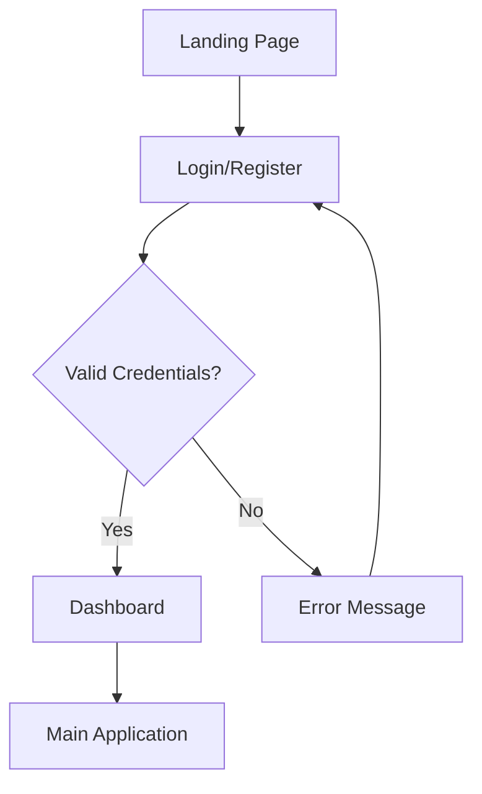
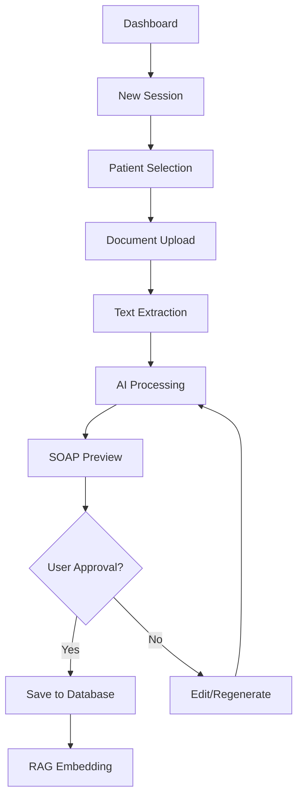
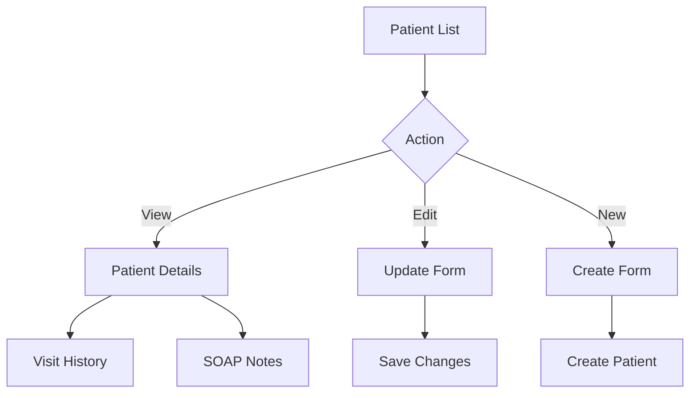
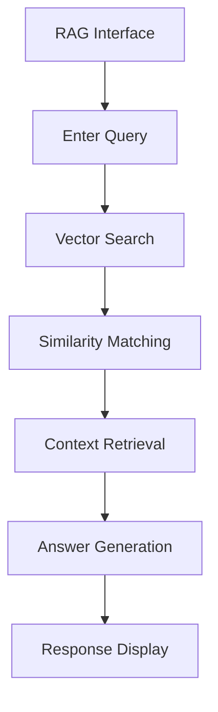

# Echo Notes - AI-Powered SOAP Note Generation System

**An intelligent healthcare documentation platform for hearing care professionals**

[](LICENSE)
[](docker-compose.unified.yaml)
[](ai_service/)
[](backend/)
[](frontend/)

---

## 🎯 **Project Overview**

Echo Notes revolutionizes healthcare documentation by using advanced AI to automatically generate SOAP (Subjective, Objective, Assessment, Plan) notes from patient visit transcripts. Built with a modern microservice architecture, it ensures scalability, security, and performance for healthcare professionals.

### **🏥 Key Features**

- 🤖 **AI-Powered SOAP Generation** - Automated medical note creation using LLaMA 3 and GPT-4
- 🔒 **PII Protection** - Advanced privacy-preserving text processing with Microsoft Presidio
- 🔍 **RAG-based Queries** - Intelligent patient data retrieval using vector embeddings
- 📄 **Document Management** - Secure file storage and processing with AWS S3
- 📊 **Real-time Monitoring** - Comprehensive service health and performance tracking
- 🌐 **Modern UI/UX** - Responsive Next.js interface with Tailwind CSS

---

## 🏗️ **System Architecture**

### **Microservice Design Pattern**

Echo Notes follows a **microservice architecture** with clear separation between business logic and AI operations:

```
┌─────────────────────────────────────────────────────────────┐
│                    Production Environment                    │
│                                                             │
│  ┌─────────────────┐  ┌──────────────────┐  ┌─────────────┐ │
│  │  Main Backend   │  │   AI Service     │  │ PostgreSQL  │ │
│  │   (Port 8001)   │  │   (Port 8002)    │  │ + pgvector  │ │
│  │                 │  │                  │  │ (Port 5432) │ │
│  │ • FastAPI       │  │ • FastAPI        │  │             │ │
│  │ • Business      │  │ • AI Models      │  │ • Shared DB │ │
│  │   Logic         │  │ • Model Cache    │  │ • Vector    │ │
│  │ • HTTP Client   │◄─┤ • Transformers   │  │   Search    │ │
│  │ • Database      │  │ • OpenAI API     │  │             │ │
│  │   Operations    │  │ • HuggingFace    │  │             │ │
│  └─────────────────┘  └──────────────────┘  └─────────────┘ │
│           ▲                      ▲                 ▲        │
│           │                      │                 │        │
│  ┌────────▼────┐        ┌────────▼─────┐     ┌─────▼──────┐ │
│  │ Next.js     │        │   AWS S3     │     │  Model     │ │
│  │ Frontend    │        │  Document    │     │  Cache     │ │
│  │ (Port 3000) │        │   Storage    │     │  Volume    │ │
│  └─────────────┘        └──────────────┘     └────────────┘ │
└─────────────────────────────────────────────────────────────┘
```

### **Layered Architecture Pattern**

#### **Main Backend Service** (FastAPI - Port 8001)

```
┌─────────────────────────────────────────┐
│              HTTP Layer                 │
│  ┌─────────────────┐ ┌─────────────────┐ │
│  │   Controllers   │ │     Routes      │ │
│  │                 │ │                 │ │
│  │ • AuthController│ │ • /auth/*       │ │
│  │ • SOAPController│ │ • /soap/*       │ │
│  │ • UserController│ │ • /users/*      │ │
│  │ • RAGController │ │ • /rag/*        │ │
│  └─────────────────┘ └─────────────────┘ │
└─────────────────────────────────────────┘
┌─────────────────────────────────────────┐
│           Business Logic Layer          │
│  ┌─────────────────┐ ┌─────────────────┐ │
│  │    Services     │ │     Clients     │ │
│  │                 │ │                 │ │
│  │ • AuthService   │ │ • AIServiceClient│ │
│  │ • AISoapService │ │ • S3Client      │ │
│  │ • UserService   │ │ • EmailClient   │ │
│  │ • PDFService    │ │                 │ │
│  └─────────────────┘ └─────────────────┘ │
└─────────────────────────────────────────┘
┌─────────────────────────────────────────┐
│            Data Access Layer            │
│  ┌─────────────────┐ ┌─────────────────┐ │
│  │  Repositories   │ │     Models      │ │
│  │                 │ │                 │ │
│  │ • PatientRepo   │ │ • Professional  │ │
│  │ • SOAPNotesRepo │ │ • Patients      │ │
│  │ • SessionRepo   │ │ • SOAPNotes     │ │
│  └─────────────────┘ └─────────────────┘ │
└─────────────────────────────────────────┘
┌─────────────────────────────────────────┐
│            Database Layer               │
│         PostgreSQL + pgvector           │
└─────────────────────────────────────────┘
```

#### **AI Microservice** (FastAPI - Port 8002)

```
┌─────────────────────────────────────────┐
│              API Layer                  │
│  ┌─────────────┐ ┌─────────────────────┐ │
│  │ API Routes  │ │    Endpoints        │ │
│  │             │ │                     │ │
│  │ soap_api.py │ │ POST /soap/generate │ │
│  │ ner_api.py  │ │ POST /ner/extract   │ │
│  │ pii_api.py  │ │ POST /pii/anonymize │ │
│  │ rag_api.py  │ │ POST /embeddings/*  │ │
│  └─────────────┘ └─────────────────────┘ │
└─────────────────────────────────────────┘
┌─────────────────────────────────────────┐
│           AI Services Layer             │
│  ┌─────────────┐ ┌─────────────────────┐ │
│  │ AI Services │ │   Model Management  │ │
│  │             │ │                     │ │
│  │ SOAPService │ │ • Model Loading     │ │
│  │ NERService  │ │ • Caching Strategy  │ │
│  │ PIIService  │ │ • Performance Opt   │ │
│  │ RAGService  │ │ • Memory Management │ │
│  └─────────────┘ └─────────────────────┘ │
└─────────────────────────────────────────┘
┌─────────────────────────────────────────┐
│          External APIs Layer            │
│    OpenAI • HuggingFace • Presidio      │
└─────────────────────────────────────────┘
```

---

## 🚀 **Tech Stack**

### **Backend Technologies**

| Component                 | Technology               | Purpose                                          |
| ------------------------- | ------------------------ | ------------------------------------------------ |
| **Framework**             | FastAPI 0.104+           | High-performance async web framework             |
| **Language**              | Python 3.11+             | Modern Python with type hints                    |
| **Database**              | PostgreSQL 17 + pgvector | Relational DB with vector operations             |
| **ORM**                   | SQLAlchemy 2.0 + Alembic | Database modeling and migrations                 |
| **Validation**            | Pydantic V2              | Data validation and serialization                |
| **Authentication**        | JWT + Bcrypt             | Secure token-based auth                          |
| **HTTP Client**           | httpx                    | Async HTTP client for microservice communication |
| **Dependency Management** | uv                       | Modern Python package manager                    |

### **AI/ML Technologies**

| Component           | Technology                    | Purpose                             |
| ------------------- | ----------------------------- | ----------------------------------- |
| **SOAP Generation** | LLaMA 3 (70B) via HuggingFace | Advanced biomedical text generation |
| **Judge LLM**       | GPT-4o-mini                   | Quality validation and scoring      |
| **Embeddings**      | OpenAI text-embedding-3-small | Vector embeddings for RAG           |
| **NER**             | d4data/biomedical-ner-all     | Biomedical named entity recognition |
| **PII Detection**   | Microsoft Presidio            | Privacy-preserving text processing  |
| **Vector Search**   | pgvector                      | Cosine similarity search            |
| **ML Framework**    | Transformers + LangChain      | Model orchestration                 |

### **Frontend Technologies**

| Component            | Technology            | Purpose                          |
| -------------------- | --------------------- | -------------------------------- |
| **Framework**        | Next.js 15            | React-based full-stack framework |
| **UI Library**       | React 19              | Modern component-based UI        |
| **Styling**          | Tailwind CSS 4        | Utility-first CSS framework      |
| **Components**       | Radix UI              | Accessible component library     |
| **Forms**            | React Hook Form       | Performant forms with validation |
| **State Management** | React Context + Hooks | Client state management          |
| **API Client**       | Fetch API             | RESTful API communication        |
| **Icons**            | Lucide React          | Beautiful SVG icons              |

### **DevOps & Infrastructure**

| Component            | Technology              | Purpose                              |
| -------------------- | ----------------------- | ------------------------------------ |
| **Containerization** | Docker + Docker Compose | Container orchestration              |
| **Deployment**       | Ubuntu EC2 + Nginx      | Cloud deployment with load balancing |
| **Storage**          | AWS S3                  | Document and file storage            |
| **Monitoring**       | Structured Logging      | Application observability            |
| **CI/CD**            | Git-based deployment    | Automated deployment pipeline        |

---

## 📱 **Frontend Architecture & User Flows**

### **Application Structure**

```
frontend/
├── app/                    # Next.js 13+ App Router
│   ├── (auth)/            # Authentication pages
│   │   ├── login/         # User login
│   │   └── register/      # User registration
│   ├── dashboard/         # Main dashboard
│   ├── patients/          # Patient management
│   │   ├── [id]/         # Patient details
│   │   └── new/          # Add new patient
│   ├── sessions/          # Visit sessions
│   │   ├── [id]/         # Session details
│   │   └── new/          # New session
│   ├── documents/         # Document management
│   │   ├── upload/       # File upload
│   │   └── [id]/view/    # Document viewer
│   ├── soap/             # SOAP note management
│   │   ├── generate/     # SOAP generation
│   │   └── notes/[id]/   # Note viewer
│   └── rag/              # RAG queries
│       └── query/        # Knowledge base search
├── components/ui/         # Reusable UI components
├── lib/                  # Utility functions
└── routes/               # API route configurations
```

### **User Journey Flows**

#### **1. Authentication Flow**



#### **2. SOAP Generation Flow**



#### **3. Patient Management Flow**



#### **4. RAG Query Flow**



### **Component Architecture**

#### **UI Component Hierarchy**

```
App Layout
├── Navigation Bar
│   ├── Logo
│   ├── Menu Items
│   └── User Profile
├── Sidebar
│   ├── Dashboard Link
│   ├── Patients Link
│   ├── Sessions Link
│   └── SOAP Notes Link
├── Main Content
│   ├── Page Header
│   ├── Breadcrumbs
│   └── Dynamic Content
└── Footer
    ├── Status Indicators
    └── Version Info
```

#### **State Management Strategy**

```typescript
// Global State (React Context)
interface AppState {
  user: User | null;
  currentPatient: Patient | null;
  activeSessions: Session[];
  notifications: Notification[];
}

// Component State (React Hooks)
interface ComponentState {
  formData: FormState;
  loading: boolean;
  errors: ValidationErrors;
  modalOpen: boolean;
}
```

---

## 🎯 **Unique Selling Propositions (USPs)**

### **1. 🤖 Advanced AI Integration**

- **Dual LLM Architecture**: Combines LLaMA 3 (70B) for generation with GPT-4o-mini for validation
- **Biomedical Specialization**: Custom-trained models for hearing care terminology
- **Quality Assurance**: AI judge validates note quality before saving
- **Context Awareness**: RAG system provides relevant historical context

### **2. 🔒 Privacy-First Design**

- **PII Protection**: Microsoft Presidio integration for automatic PII detection
- **Selective Anonymization**: Preserves medical context while protecting privacy
- **HIPAA Compliance**: Designed with healthcare regulations in mind
- **Audit Trail**: Complete logging of all data access and modifications

### **3. 🏗️ Scalable Microservice Architecture**

- **Independent Scaling**: AI services scale separately from business logic
- **Resource Optimization**: Dedicated GPU resources for AI workloads
- **Fault Tolerance**: Circuit breaker patterns prevent cascading failures
- **Performance**: Async operations and intelligent caching

### **4. 📊 Intelligent Knowledge Management**

- **Vector Search**: pgvector enables semantic similarity search
- **RAG Integration**: Retrieve relevant patient history for context
- **Smart Recommendations**: AI suggests relevant information during note creation
- **Continuous Learning**: System improves with usage patterns

### **5. 🎨 Modern User Experience**

- **Responsive Design**: Works seamlessly across desktop, tablet, and mobile
- **Real-time Updates**: Live status indicators and progress tracking
- **Intuitive Workflow**: Streamlined process from upload to final note
- **Accessibility**: WCAG compliant interface design

### **6. 🚀 Developer-Friendly Infrastructure**

- **One-Command Deployment**: Unified Docker Compose setup
- **Modern Tooling**: uv for Python, Next.js 15, TypeScript
- **Comprehensive Testing**: Automated testing for all components
- **Clear Documentation**: Extensive docs and architecture guides

---

## 🔄 **API Integration & Communication**

### **Inter-Service Communication**

#### **Main Backend ↔ AI Service**

```python
# AIServiceClient in Main Backend
class AIServiceClient:
    async def generate_soap_note(self, request_data: Dict) -> Dict:
        """Generate SOAP note via AI service"""
        response = await self.client.post("/soap/generate", json=request_data)
        return response.json()

    async def extract_ner_entities(self, text: str) -> Dict:
        """Extract entities via AI service"""
        response = await self.client.post("/ner/extract", json={"text": text})
        return response.json()
```

#### **Frontend ↔ Backend API**

```typescript
// API Client in Frontend
class ApiClient {
  async generateSOAP(sessionId: string, text: string): Promise<SOAPNote> {
    const response = await fetch("/api/soap/generate", {
      method: "POST",
      headers: { "Content-Type": "application/json" },
      body: JSON.stringify({ session_id: sessionId, text }),
    });
    return response.json();
  }
}
```

### **Error Handling Strategy**

```python
# Circuit Breaker Pattern
class AIServiceClient:
    def __init__(self):
        self.circuit_breaker = CircuitBreaker(
            failure_threshold=5,
            timeout=60,
            expected_exception=httpx.HTTPError
        )

    @circuit_breaker
    async def generate_soap_note(self, data: Dict) -> Dict:
        # AI service call with automatic circuit breaking
        pass
```

---

## 📊 **Database Schema & Data Flow**

### **Core Entity Relationships**

```sql
-- Professional (Healthcare Workers)
professional (id, name, email, role, department)
    ↓
-- Patients (Healthcare Recipients)
patients (id, name, email, phone, address)
    ↓
-- Visit Sessions (Encounters)
patient_visit_sessions (session_id, patient_id, professional_id, visit_date)
    ↓
-- Documents (Files/Transcripts)
uploaded_documents (document_id, session_id, s3_link, extracted_text)
    ↓
-- SOAP Notes (Generated Notes with Vector Embeddings)
session_soap_notes (note_id, session_id, content, embedding[1536])
```

### **Vector Search Implementation**

```sql
-- Semantic similarity search for RAG
SELECT
    note_id,
    content,
    1 - (embedding <=> $1) as similarity
FROM session_soap_notes
WHERE embedding IS NOT NULL
    AND 1 - (embedding <=> $1) > 0.7
ORDER BY embedding <=> $1
LIMIT 10;
```

---

## 🚀 **Quick Start Guide**

### **Prerequisites**

- **Docker & Docker Compose** (Latest version)
- **Python 3.11+** (for local development)
- **Node.js 18+** (for frontend development)
- **PostgreSQL** (if running locally)

### **1. Environment Setup**

```bash
# Clone the repository
git clone <repository-url>
cd echo-notes-service

# Copy environment templates
cp .env.sample .env
cp backend/.env.sample backend/.env
cp ai_service/.env.sample ai_service/.env
cp frontend/.env.sample frontend/.env.local

# Update with your API keys
# Edit .env files with actual OpenAI and HuggingFace keys
```

### **2. Unified Development Deployment**

```bash
# Windows
run-dev-unified.bat

# Linux/Mac
./run-dev-unified.sh
```

### **3. Production Deployment**

```bash
# Deploy to EC2
./deploy-ec2-unified.sh

# Or manual Docker deployment
docker-compose -f docker-compose.unified.yaml up --build -d
```

### **4. Access Points**

After deployment, access the application at:

- **🌐 Main Application**: http://localhost
- **🎨 Frontend**: http://localhost:3000
- **🖥️ Backend API**: http://localhost:8001
- **🤖 AI Service**: http://localhost:8002
- **📚 API Documentation**:
  - Backend: http://localhost:8001/docs
  - AI Service: http://localhost:8002/docs

---

## 📚 **Documentation**

### **Architecture Documents**

- **[Backend Architecture PRD](BACKEND_ARCHITECTURE_PRD.md)** - Comprehensive system design
- **[Unified Architecture](UNIFIED_ARCHITECTURE.md)** - Container architecture guide
- **[EC2 Deployment Guide](EC2_DEPLOYMENT_GUIDE.md)** - Cloud deployment instructions

### **API Documentation**

- **Backend API**: Available at `/docs` endpoint (Swagger UI)
- **AI Service API**: Available at `/docs` endpoint (OpenAPI)
- **Frontend Routes**: Documented in `frontend/routes/`

### **Development Guides**

- **Backend Setup**: See `backend/README.md`
- **AI Service Setup**: See `ai_service/README.md`
- **Frontend Setup**: See `frontend/README.md`

---

## 🤝 **Contributing**

### **Development Workflow**

1. **Fork** the repository
2. **Create** a feature branch (`git checkout -b feature/amazing-feature`)
3. **Commit** your changes (`git commit -m 'Add amazing feature'`)
4. **Push** to the branch (`git push origin feature/amazing-feature`)
5. **Open** a Pull Request

### **Code Standards**

- **Backend**: Follow PEP 8, use type hints, add docstrings
- **Frontend**: Use TypeScript, follow React best practices
- **Testing**: Write tests for new features
- **Documentation**: Update docs for API changes

---

## 📝 **License**

This project is licensed under the MIT License - see the [LICENSE](LICENSE) file for details.

---

## 🆘 **Support**

### **Getting Help**

- **Documentation**: Check the comprehensive docs in `/docs`
- **Issues**: Report bugs via GitHub Issues
- **Discussions**: Join project discussions
- **Email**: Contact the development team

### **Common Issues**

- **Memory Issues**: AI service requires 8GB+ RAM
- **Model Loading**: First startup takes 10-15 minutes
- **API Keys**: Ensure OpenAI and HuggingFace keys are valid
- **Network**: Check firewall settings for inter-service communication

---

## 🎉 **Acknowledgments**

- **OpenAI** - For GPT-4 and embedding models
- **HuggingFace** - For biomedical LLaMA models
- **Microsoft** - For Presidio PII detection
- **Vercel** - For Next.js framework
- **FastAPI Team** - For the excellent web framework

---

**Built with ❤️ for Healthcare Professionals**

_Transforming healthcare documentation through AI innovation_
