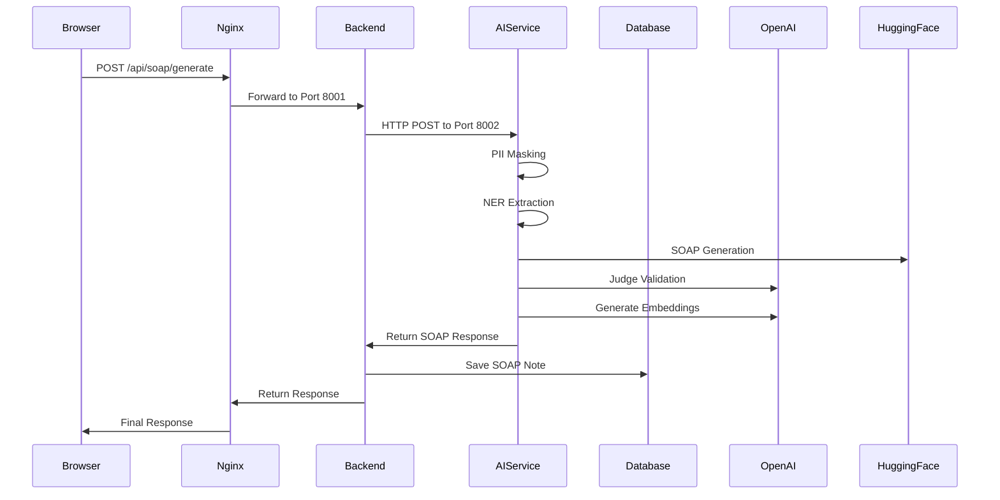

# Echo Notes - Unified Container Architecture

## Overview

This document describes the unified container architecture for Echo Notes, where the Backend (FastAPI), AI Service (FastAPI), and Frontend (Next.js) all run within a single Docker container while maintaining microservice principles.

## Architecture Philosophy

### Microservice Within Container

- **Not Monolithic**: Each service maintains its own codebase, APIs, and responsibilities
- **Process Separation**: Services run as separate processes managed by Supervisor
- **Port Isolation**: Each service runs on its dedicated port
- **API Boundaries**: Clear HTTP API boundaries between services
- **Independent Scaling**: Services can be extracted to separate containers later

### Development Benefits

- **Single Command Deployment**: One script starts the entire environment
- **Simplified Development**: No complex networking setup required
- **Resource Efficiency**: Shared resources while maintaining service boundaries
- **Easy Debugging**: All services accessible on different ports

---

## Container Architecture

### Process Management (Supervisor)

```
┌─────────────────────────────────────────────────────────────┐
│                    Single Docker Container                   │
│  ┌─────────────────────────────────────────────────────────┐ │
│  │                   Supervisor                            │ │
│  │  ┌─────────────┐  ┌─────────────┐  ┌─────────────┐     │ │
│  │  │    Nginx    │  │   Backend   │  │ AI Service  │     │ │
│  │  │   Port 80   │  │  Port 8001  │  │ Port 8002   │     │ │
│  │  └─────────────┘  └─────────────┘  └─────────────┘     │ │
│  │  ┌─────────────┐                                       │ │
│  │  │  Frontend   │                                       │ │
│  │  │  Port 3000  │                                       │ │
│  │  └─────────────┘                                       │ │
│  └─────────────────────────────────────────────────────────┘ │
└─────────────────────────────────────────────────────────────┘
```

### Service Responsibilities

#### 1. **Nginx Proxy (Port 80)**

- **Purpose**: Main entry point and reverse proxy
- **Routes**:
  - `/` → Frontend (Next.js)
  - `/api/*` → Backend (FastAPI)
  - `/ai/*` → AI Service (FastAPI)
- **Features**: Load balancing, SSL termination (future), request routing

#### 2. **Backend Service (Port 8001)**

- **Technology**: FastAPI with SQLAlchemy
- **Responsibilities**:
  - User authentication and authorization
  - Patient and session management
  - Document upload and storage
  - Business logic and validation
  - Database operations (CRUD)
  - Audit logging
- **AI Integration**: HTTP client to AI Service

#### 3. **AI Service (Port 8002)**

- **Technology**: FastAPI with ML libraries
- **Responsibilities**:
  - SOAP note generation (HuggingFace + OpenAI)
  - Named Entity Recognition (Transformers)
  - PII detection and anonymization (Presidio)
  - Text embeddings (OpenAI)
  - Model loading and caching
- **Models**: Cached in `/app/.cache` volume

#### 4. **Frontend Service (Port 3000)**

- **Technology**: Next.js 15 with React 19
- **Responsibilities**:
  - User interface and experience
  - API consumption
  - State management
  - Responsive design
- **API Access**: Routes through Nginx proxy

---

## Port Configuration

### External Access Points

```
┌─────────────────┬─────────────────┬─────────────────────────────┐
│ Port            │ Service         │ Purpose                     │
├─────────────────┼─────────────────┼─────────────────────────────┤
│ 80              │ Nginx Proxy     │ Main application access     │
│ 3000            │ Frontend        │ Direct frontend access      │
│ 8001            │ Backend         │ Direct API access           │
│ 8002            │ AI Service      │ Direct AI API access        │
│ 5432            │ Database        │ PostgreSQL access           │
└─────────────────┴─────────────────┴─────────────────────────────┘
```

### Internal Communication

```
Frontend ──┐
           ├── Nginx Proxy ── Backend ── AI Service
Browser ───┘                     │         │
                                 └─────────┴── Database
```

---

## API Architecture

### Request Flow Examples

#### 1. **User Login Flow**

```
Browser → Nginx (Port 80) → Backend (Port 8001) → Database
```

#### 2. **SOAP Generation Flow**

```
Browser → Nginx → Backend → AI Service → External APIs
                    │           │
                    └─── Database ──┘
```

#### 3. **Direct API Access**

```
Developer Tools → Backend (Port 8001) → AI Service (Port 8002)
```

### API Endpoints

#### Backend API (Port 8001)

```
Authentication:
POST   /auth/login
POST   /auth/register
GET    /auth/me

User Management:
GET    /patients
POST   /patients
GET    /sessions
POST   /sessions

Documents:
POST   /documents/upload
GET    /documents

SOAP Notes:
POST   /soap/generate    # Proxies to AI Service
GET    /soap/notes

RAG Queries:
POST   /rag/query        # Proxies to AI Service
```

#### AI Service API (Port 8002)

```
SOAP Generation:
POST   /soap/generate
GET    /soap/health

NER Extraction:
POST   /ner/extract
POST   /ner/context

PII Detection:
POST   /pii/analyze
POST   /pii/anonymize

Embeddings:
POST   /embeddings/generate
POST   /embeddings/batch
```

---

## Data Flow

### SOAP Generation Complete Flow



---

## Development Workflow

### 1. **Environment Setup**

```bash
# Clone repository
git clone <repository-url>
cd echo-notes-service

# Run unified environment
./run-dev-unified.sh    # Linux/Mac
run-dev-unified.bat     # Windows
```

### 2. **Access Points During Development**

- **Main App**: http://localhost (Nginx proxy)
- **Frontend**: http://localhost:3000 (Direct Next.js)
- **Backend API**: http://localhost:8001 (Direct FastAPI)
- **AI Service**: http://localhost:8002 (Direct FastAPI)
- **API Docs**:
  - Backend: http://localhost:8001/docs
  - AI Service: http://localhost:8002/docs

### 3. **Development Features**

- **Hot Reload**: Frontend supports hot reload for development
- **API Testing**: Direct access to each service for testing
- **Log Aggregation**: All service logs through Docker Compose
- **Health Monitoring**: Individual service health checks

---

## Configuration Management

### Environment Variables

#### Shared Configuration (.env)

```bash
# API Keys
OPENAI_API_KEY=your_openai_key
HUGGINGFACEHUB_API_TOKEN=your_hf_token

# Database
DATABASE_URL=postgresql+asyncpg://postgres:postgres@db:5432/echo_note_rag

# Authentication
JWT_SECRET_KEY=dev-secret-key

# CORS
CORS_ORIGINS=http://localhost,http://localhost:3000,http://localhost:80
```

#### Service-Specific Configuration

- **Backend**: JWT, CORS, Database connections
- **AI Service**: Model paths, API endpoints, caching
- **Frontend**: API URLs, build configuration

---

## Performance Considerations

### Resource Allocation

```
┌─────────────────┬─────────────────┬─────────────────┐
│ Service         │ CPU Usage       │ Memory Usage    │
├─────────────────┼─────────────────┼─────────────────┤
│ Nginx           │ Low (< 1%)      │ ~50MB           │
│ Backend         │ Medium (10-20%) │ ~500MB          │
│ AI Service      │ High (30-60%)   │ ~4GB            │
│ Frontend        │ Low (< 5%)      │ ~200MB          │
│ Total Container │ ~2-4 cores      │ ~8GB            │
└─────────────────┴─────────────────┴─────────────────┘
```

### Optimization Strategies

1. **Model Caching**: Persistent volumes for AI models
2. **Connection Pooling**: Database connection optimization
3. **Process Management**: Supervisor for efficient process handling
4. **Resource Limits**: Docker resource constraints

---

## Deployment Options

### 1. **Development (Current)**

```bash
# Single container with all services
docker-compose -f docker-compose.unified.yaml up
```

### 2. **Production Migration Path**

```bash
# Separate containers (future)
docker-compose -f docker-compose.ai.yaml up  # Existing separate containers
```

### 3. **Kubernetes Migration Path**

```yaml
# Each service as separate pod
apiVersion: apps/v1
kind: Deployment
metadata:
  name: backend-deployment
---
apiVersion: apps/v1
kind: Deployment
metadata:
  name: ai-service-deployment
```

---

## Monitoring and Debugging

### Service Health Checks

```bash
# Check all services
curl http://localhost/health
curl http://localhost:8001/health
curl http://localhost:8002/health
curl http://localhost:3000

# Check individual components
docker-compose -f docker-compose.unified.yaml ps
docker-compose -f docker-compose.unified.yaml logs -f [service]
```

### Log Management

```bash
# View all logs
docker-compose -f docker-compose.unified.yaml logs -f

# View specific service logs
docker exec echo_notes_unified_app supervisorctl tail -f backend
docker exec echo_notes_unified_app supervisorctl tail -f ai_service
docker exec echo_notes_unified_app supervisorctl tail -f frontend
```

### Process Management

```bash
# Access container
docker exec -it echo_notes_unified_app bash

# Check supervisor status
supervisorctl status

# Restart individual services
supervisorctl restart backend
supervisorctl restart ai_service
supervisorctl restart frontend
```

---

## Migration Strategy

### From Unified to Separate Containers

1. **Phase 1**: Unified container (current)
2. **Phase 2**: Extract AI service to separate container
3. **Phase 3**: Full microservice deployment with orchestration

### Benefits of Current Approach

- **Rapid Development**: Quick setup and iteration
- **Resource Efficiency**: Shared container resources
- **Simplified Networking**: No complex service discovery
- **Easy Debugging**: All services in one place

### Future Extraction Benefits

- **Independent Scaling**: Scale AI service separately
- **Technology Flexibility**: Different base images per service
- **Deployment Flexibility**: Deploy services independently
- **Resource Optimization**: Dedicated resources per service

---

## Conclusion

The unified container architecture provides:

✅ **Microservice Benefits**: Clear service boundaries and responsibilities  
✅ **Development Speed**: Single command environment setup  
✅ **Resource Efficiency**: Shared container infrastructure  
✅ **Easy Debugging**: All services accessible for development  
✅ **Future Flexibility**: Clear migration path to separate containers  
✅ **Production Ready**: Scalable architecture foundation

This approach bridges the gap between monolithic simplicity and microservice flexibility, providing an optimal development experience while maintaining architectural integrity.
